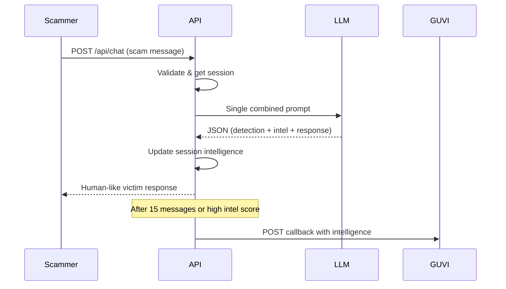

# 🍯 AI Agentic Honeypot for Scam Detection & Intelligence Extraction

> **GUVI Hackathon 2026 Submission**  
> An AI-powered honeypot system that autonomously detects scam messages, engages scammers with convincing human-like personas, and extracts actionable intelligence.

[](https://python.org)
[](https://fastapi.tiangolo.com)
[](LICENSE)

---

## 📋 Table of Contents

- [Overview](#-overview)
- [Key Features](#-key-features)
- [System Architecture](#-system-architecture)
- [Tech Stack](#-tech-stack)
- [How It Works](#-how-it-works)
- [Quick Start](#-quick-start)
- [API Documentation](#-api-documentation)
- [Project Structure](#-project-structure)
- [Success Metrics](#-success-metrics)
- [What Makes Us Unique](#-what-makes-us-unique)
- [Testing](#-testing)
- [Deployment](#-deployment)
- [License](#-license)

---

## 🎯 Overview

This AI Honeypot is an **agentic scam-fighting system** designed to:

1. **Detect** incoming scam messages with >90% accuracy
2. **Engage** scammers using 5 adaptive victim personas
3. **Extract** intelligence (bank accounts, UPI IDs, phishing links, phone numbers)
4. **Report** findings to GUVI's evaluation endpoint automatically

The system uses a single-call optimized LLM architecture to stay within Groq's free tier limits while maximizing engagement quality.

### Problem Statement

Scammers continuously target vulnerable individuals through SMS, WhatsApp, and email. Traditional detection systems simply block messages, but this honeypot goes further by:

- Wasting scammers' time
- Extracting their payment details for law enforcement
- Learning scam patterns for better future detection

---

## ✨ Key Features

### 🔍 Multi-Factor Scam Detection

- **LLM-based Analysis**: Groq's llama-3.3-70b-versatile for intelligent classification
- **Keyword Fallback**: 50+ scam indicator keywords for robustness
- **Confidence Scoring**: 0.0-1.0 scale with 0.65 threshold
- **Scam Type Classification**: bank_fraud, upi_fraud, phishing, job_scam, lottery, investment, tech_support

### 🎭 Adaptive Persona System (5 Personas)

| Persona                  | Age   | Tech Skill  | Best For                 |
| ------------------------ | ----- | ----------- | ------------------------ |
| **Elderly Confused**     | 65-80 | Very Low    | Bank fraud, tech support |
| **Busy Professional**    | 30-45 | Medium      | UPI fraud, phishing      |
| **Curious Student**      | 18-25 | Medium-High | Investment, fake offers  |
| **Tech-Naive Parent**    | 40-60 | Low         | Bank fraud, UPI fraud    |
| **Desperate Job Seeker** | 25-40 | Medium      | Job scams, investment    |

Each persona includes:

- Natural language patterns with realistic typos
- Emotional state progression
- Human-like quirks and imperfections
- Stage-appropriate conversation tactics

### 📊 Intelligence Extraction

Real-time extraction using LLM + regex hybrid approach:

- **Bank Account Numbers** (9-18 digits)
- **UPI IDs** (name@bankname format)
- **Phone Numbers** (Indian 10-digit format)
- **Phishing Links** (HTTP/HTTPS URLs)
- **Suspicious Keywords** (urgency indicators)

### 🔄 7-Stage Conversation Flow

1. **Initial Hook** - Scammer's opening message
2. **Engagement** - Build trust, show interest
3. **Information Probe** - Scammer requests details
4. **Resistance** - Show human-like hesitation
5. **Gradual Compliance** - Slowly provide information
6. **Intelligence Mining** - Extract scammer's payment details
7. **Prolongation** - Keep conversation going for maximum intel

### 📡 GUVI Callback Integration

Automatic reporting to `https://hackathon.guvi.in/api/updateHoneyPotFinalResult` when:

- Session reaches 15 message exchanges
- Intelligence score threshold (8.0) achieved
- High-value intel extracted

### ⚡ Rate Limit Optimization

Optimized for Groq's free tier limits:

- **RPM**: 30 requests/minute
- **RPD**: 1,000 requests/day
- **TPM**: 12,000 tokens/minute
- **TPD**: 100,000 tokens/day

**Key Optimization**: Single LLM call per message combines detection + extraction + response generation.

---

## 🏗️ System Architecture

```
                    ┌─────────────────────────────────────┐
                    │       GUVI Mock Scammer/Tester       │
                    └──────────────────┬──────────────────┘
                                       │ POST /api/chat
                                       ▼
┌──────────────────────────────────────────────────────────────────────┐
│                        FastAPI Application                             │
│  ┌────────────────────────────────────────────────────────────────┐  │
│  │                     Request Processing Pipeline                  │  │
│  │                                                                  │  │
│  │   ┌────────────┐   ┌────────────────┐   ┌─────────────────┐   │  │
│  │   │  Validator │──▶│ Session Manager │──▶│ Optimized Agent │   │  │
│  │   │  (Pydantic)│   │  (In-Memory)    │   │  (Combined LLM) │   │  │
│  │   └────────────┘   └────────────────┘   └───────┬─────────┘   │  │
│  │                                                  │              │  │
│  │   ┌──────────────────────────────────────────────┴──────────┐  │  │
│  │   │                   SINGLE LLM CALL                        │  │  │
│  │   │  ┌──────────┐  ┌────────────┐  ┌─────────────────────┐  │  │  │
│  │   │  │ Detection │  │ Extraction │  │ Response Generation │  │  │  │
│  │   │  └──────────┘  └────────────┘  └─────────────────────┘  │  │  │
│  │   └──────────────────────────────────────────────────────────┘  │  │
│  │                                                                  │  │
│  │   ┌────────────────┐   ┌───────────────┐   ┌────────────────┐  │  │
│  │   │ Response Vary  │──▶│  Rate Limiter │──▶│ GUVI Callback  │  │  │
│  │   │    Engine      │   │  (Token Bucket)│   │   Handler      │  │  │
│  │   └────────────────┘   └───────────────┘   └────────────────┘  │  │
│  └────────────────────────────────────────────────────────────────┘  │
└──────────────────────────────────────────────────────────────────────┘
                                       │
                                       ▼
                    ┌─────────────────────────────────────┐
                    │         Groq LLM API                 │
                    │    (llama-3.3-70b-versatile)         │
                    └─────────────────────────────────────┘
```

### Component Breakdown

| Component                  | File                              | Purpose                                    |
| -------------------------- | --------------------------------- | ------------------------------------------ |
| **API Layer**              | `app/api/routes.py`               | Request routing, validation, metrics       |
| **Session Manager**        | `app/core/session.py`             | In-memory session storage with TTL         |
| **Optimized Agent**        | `app/agents/optimized.py`         | Combined detection + extraction + response |
| **Persona Manager**        | `app/agents/personas.py`          | 5 victim persona definitions               |
| **Enhanced Personas**      | `app/agents/enhanced_personas.py` | Human-like variation patterns              |
| **Intelligence Extractor** | `app/agents/extractor.py`         | Pattern-based intel extraction             |
| **Rate Limiter**           | `app/utils/rate_limiter.py`       | Token bucket for Groq limits               |
| **GUVI Callback**          | `app/utils/callbacks.py`          | Final result reporting                     |

---

## 🛠️ Tech Stack

| Layer               | Technology                     | Rationale                                 |
| ------------------- | ------------------------------ | ----------------------------------------- |
| **Backend**         | FastAPI 0.109+                 | Async support, auto-docs, easy deployment |
| **LLM Provider**    | Groq (llama-3.3-70b-versatile) | Fast inference, free tier, JSON mode      |
| **Session Storage** | Python Dict (in-memory)        | Simple, no external dependencies          |
| **Deployment**      | Railway                        | Free tier, zero-config Python             |
| **Frontend**        | HTML/CSS/JS                    | Interactive dashboard for testing         |
| **HTTP Client**     | httpx                          | Async HTTP for callbacks                  |

---

## ⚙️ How It Works

### Request Flow



### Intelligence Scoring

```python
score = (
    bank_accounts × 3 +      # Highest value
    upi_ids × 2 +            # High value
    phishing_links × 2 +     # High value
    phone_numbers × 1 +      # Medium value
    keywords × 0.5           # Context only
)
# Bonus 1.2× if 3+ different types extracted
```

---

## 🚀 Quick Start

### Prerequisites

- Python 3.10+
- Groq API Key (free at [groq.com](https://groq.com))

### Installation

```bash
# Clone repository
git clone https://github.com/your-repo/agentic-honey-pot.git
cd agentic-honey-pot

# Create virtual environment
python -m venv venv
venv\Scripts\activate  # Windows
# source venv/bin/activate  # Linux/Mac

# Install dependencies
pip install -r requirements.txt

# Configure environment
cp .env.example .env
# Edit .env with your credentials
```

### Configuration

Edit `.env` file:

```env
GROQ_API_KEY=your_groq_api_key_here
API_SECRET_KEY=your_secret_key_here
GUVI_CALLBACK_URL=https://hackathon.guvi.in/api/updateHoneyPotFinalResult
ENVIRONMENT=development
```

Generate a secure API key:

```bash
python -c "import secrets; print(secrets.token_urlsafe(32))"
```

### Run Locally

```bash
python main.py
# or
uvicorn main:app --reload --port 8000
```

Access:

- **Dashboard**: http://localhost:8000/
- **API Docs**: http://localhost:8000/docs
- **Health Check**: http://localhost:8000/health

---

## 📚 API Documentation

### Endpoints

| Endpoint    | Method | Description                   |
| ----------- | ------ | ----------------------------- |
| `/`         | GET    | Interactive dashboard         |
| `/health`   | GET    | Health check with rate limits |
| `/metrics`  | GET    | Service metrics               |
| `/usage`    | GET    | Current rate limit usage      |
| `/api/chat` | POST   | Main chat endpoint            |

### POST /api/chat

**Headers:**

```
x-api-key: YOUR_API_SECRET_KEY
Content-Type: application/json
```

**Request Body:**

```json
{
  "sessionId": "unique-session-id",
  "message": {
    "sender": "scammer",
    "text": "Your account will be blocked. Verify immediately.",
    "timestamp": 1706000000000
  },
  "conversationHistory": [],
  "metadata": {
    "channel": "SMS",
    "language": "English",
    "locale": "IN"
  }
}
```

**Response:**

```json
{
  "status": "success",
  "reply": "oh no what happened?? why is my account blocked I dont understand"
}
```

### Example cURL

```bash
curl -X POST http://localhost:8000/api/chat \
  -H "x-api-key: YOUR_KEY" \
  -H "Content-Type: application/json" \
  -d '{
    "sessionId": "test-001",
    "message": {
      "sender": "scammer",
      "text": "Your bank account will be blocked. Verify immediately.",
      "timestamp": 1706000000000
    },
    "conversationHistory": [],
    "metadata": {"channel": "SMS", "language": "English", "locale": "IN"}
  }'
```

---

## 📁 Project Structure

```
agentic-honey-pot/
├── main.py                    # FastAPI entry point
├── requirements.txt           # Python dependencies
├── Procfile                   # Railway deployment
├── .env.example              # Environment template
│
├── app/
│   ├── api/
│   │   ├── routes.py         # API endpoints & logic
│   │   └── validators.py     # Pydantic request models
│   │
│   ├── core/
│   │   ├── config.py         # Settings management
│   │   ├── llm.py            # Groq client wrapper
│   │   ├── session.py        # Session management
│   │   ├── rag_config.py     # RAG configuration
│   │   └── detection_config.py
│   │
│   ├── agents/
│   │   ├── detector.py       # Scam detection agent
│   │   ├── extractor.py      # Intelligence extraction
│   │   ├── personas.py       # Base persona definitions
│   │   ├── enhanced_personas.py  # Human-like personas
│   │   ├── optimized.py      # Combined agent (main)
│   │   ├── conversation.py   # Conversation management
│   │   ├── response_variation.py
│   │   ├── natural_flow.py
│   │   └── context_aware.py
│   │
│   ├── detectors/            # Multi-factor detection
│   │   ├── linguistic_analyzer.py
│   │   ├── behavioral_analyzer.py
│   │   ├── technical_analyzer.py
│   │   ├── context_analyzer.py
│   │   └── llm_detector.py
│   │
│   ├── rag/                  # RAG system (optional)
│   │   ├── embeddings.py
│   │   ├── retriever.py
│   │   ├── knowledge_store.py
│   │   └── learning_loop.py
│   │
│   ├── utils/
│   │   ├── callbacks.py      # GUVI callback handler
│   │   ├── rate_limiter.py   # Rate limiting
│   │   └── logger.py
│   │
│   └── static/               # Dashboard UI
│       ├── index.html
│       ├── css/style.css
│       └── js/app.js
│
├── tests/
│   ├── test_api.py
│   ├── test_detector.py
│   ├── test_enhanced_detection.py
│   └── mock_data.py
│
└── docs/
    ├── AI_Honeypot_PRD.md
    ├── Advanced_Scam_Detection_Guide.md
    ├── Honeypot_Enhancement_Guide.md
    └── RAG_Implementation_Guide.md
```

---

## 📊 Success Metrics

| Metric                  | Target            | Achievement               |
| ----------------------- | ----------------- | ------------------------- |
| Scam Detection Accuracy | >90%              | ✅ LLM + keyword fallback |
| Engagement Duration     | 8-15 messages     | ✅ 7-stage conversation   |
| Intelligence Extraction | >70% yield intel  | ✅ Hybrid LLM + regex     |
| API Response Time       | <3 seconds        | ✅ Optimized single call  |
| Rate Limit Compliance   | Stay in free tier | ✅ Token bucket limiter   |

---

## 🏆 What Makes Us Unique

### 1. Single-Call Optimization

Most honeypots make 3+ LLM calls per message. We combine detection, extraction, and response in **one call**, maximizing free tier usage.

### 2. Human-Like Responses

- Natural typos and imperfections
- Emotional state progression
- Persona-specific quirks
- No obvious AI patterns

### 3. Multi-Factor Detection

- Linguistic analysis (urgency, threats, manipulation)
- Behavioral patterns (unsolicited contact, payment requests)
- Technical indicators (URL analysis, domain checking)
- Context awareness

### 4. Production-Ready

- Deployed on Railway
- Rate limiting for stability
- Comprehensive error handling
- GUVI callback integration
- Interactive testing dashboard

### 5. Extensible Architecture

- Optional RAG for continuous learning
- Modular detector system
- Easy to add new personas
- Clean separation of concerns

---

## 🧪 Testing

```bash
# Run all tests
pytest tests/ -v

# Run specific tests
pytest tests/test_api.py -v
pytest tests/test_detector.py -v
pytest tests/test_enhanced_detection.py -v
```

### Manual Testing via Dashboard

1. Start the server: `python main.py`
2. Open http://localhost:8000/
3. Enter your API key in Configuration
4. Use quick action buttons or type custom scam messages
5. Observe responses and extracted intelligence

---

## 🚢 Deployment

### Railway (Recommended)

```bash
# Install Railway CLI
npm install -g railway

# Login and deploy
railway login
railway init
railway up

# Set environment variables
railway variables set GROQ_API_KEY=your_key
railway variables set API_SECRET_KEY=your_secret
railway variables set GUVI_CALLBACK_URL=https://hackathon.guvi.in/api/updateHoneyPotFinalResult
railway variables set ENVIRONMENT=production

# Get public URL
railway domain
```

### Docker (Alternative)

```dockerfile
FROM python:3.10-slim
WORKDIR /app
COPY requirements.txt .
RUN pip install -r requirements.txt
COPY . .
CMD ["uvicorn", "main:app", "--host", "0.0.0.0", "--port", "8000"]
```

---

## 📄 License

MIT License - Built for GUVI Hackathon 2026

---

## 👥 Team

Built with ❤️ for GUVI Hackathon 2026

---

## 📞 Support

For issues or questions, please open a GitHub issue or contact the development team.
